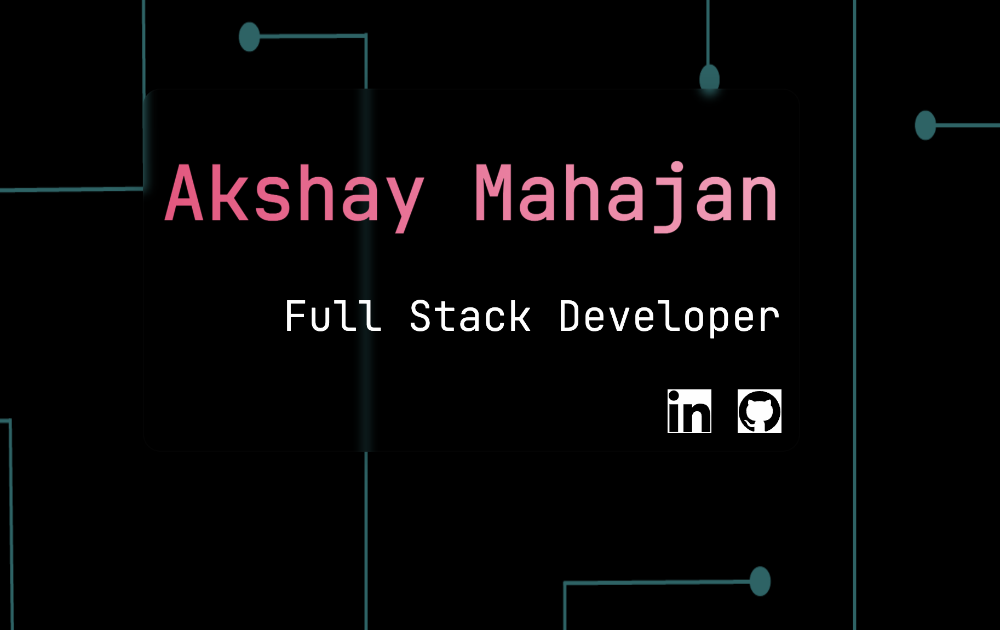

# Akshay Mahajan's portfolio

Hello!

- My name is `Akshay` and I love to solve problems.
- I am a **Full Stack Web and Mobile Apps developer**.
- This portfolio website is a showcase of some of my projects.
Some interesting things happening here:
- Ingredients -> `HTML` + `JavaScript` and `CSS`(Sass)
- Mobile and tablet responsiveness
- Accessiblity friendly
- Scroll effects
- [Vanilla tilt](https://micku7zu.github.io/vanilla-tilt.js/) for the tilting effects of cards
- [Typewriter](https://github.com/tameemsafi/typewriterjs) for the typewriter effect

**Here is the link to my portfolio website**
[Akshay Mahajan's Portfolio](https://portfolio-akshay-mahajan.netlify.app)
